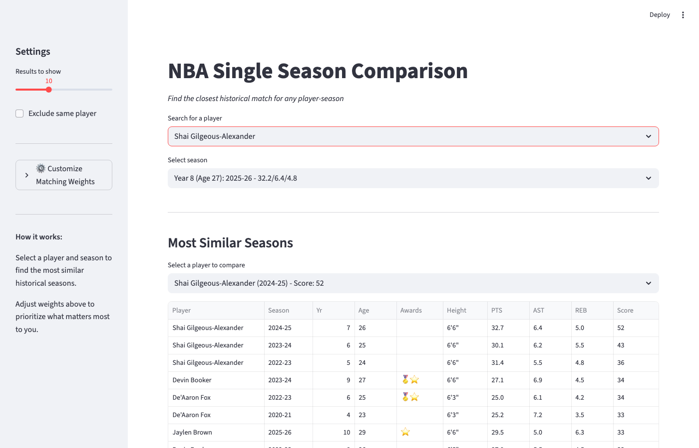
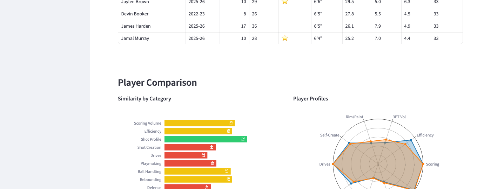

# nba-season-similarity

A player similarity engine that finds the closest historical match for any NBA player-season. Select a player and season, adjust what dimensions matter most to you, and see which player-seasons across NBA history look most like the one you picked -- across scoring, shot profile, playmaking, defense, and more.

Built on 11,400+ player-seasons from 2,350+ players spanning 2003-04 through 2025-26, using 190 features across 11 matchable dimensions.

## Screenshots

**Search for a player and see the most similar seasons ranked by similarity score:**



**Drill into any match with similarity breakdowns and radar profile overlays:**



## Features

- **190 features per player-season** spanning box score stats, tracking data, hustle stats, shooting zones, and team composition metrics
- **11 matchable dimensions**: scoring volume, efficiency, shot profile, shot creation, drives, playmaking, ball handling, rebounding, defense, usage, physical
- **Adjustable weights**: slider controls to emphasize what matters -- crank up "drives" to find players who attack the basket similarly, or boost "shot profile" to match shooting location distributions
- **Single-season granularity**: compare individual seasons, not career averages -- "who had a season most like SGA's 2025-26?"
- **Composition stats**: player production expressed as share of team totals (e.g., "25% of team assists"), making stats comparable across eras and team contexts
- **Side-by-side comparison**: color-coded stat tables (green/yellow/red for similarity), radar chart overlays, and per-dimension similarity scores
- **Award context**: season awards displayed inline so you can see which comparisons were All-Star or All-NBA caliber

## How it works

1. **Data collection**: Player stats pulled from stats.nba.com via `nba_api` -- career stats, shooting zones, hustle stats, tracking data, draft combine measurements
2. **Feature engineering**: Raw stats transformed into composition metrics (share of team production), shooting zone distributions, shot creation profiles, and defensive hustle composites
3. **Per-group standardization**: Each of the 11 feature groups is standardized independently (StandardScaler), so a 1-unit difference in "defense" means the same thing as a 1-unit difference in "playmaking"
4. **Weighted distance**: Euclidean distance computed per-group, then combined with user-adjustable weights into an overall similarity score

## Technical stack

- **Python 3.10+**
- **pandas / numpy** -- data processing and feature engineering
- **scikit-learn** -- StandardScaler for normalization, NearestNeighbors for similarity search
- **Streamlit** -- interactive web UI
- **Plotly** -- radar charts and similarity bar charts
- **nba_api** -- primary data source (stats.nba.com)
- **BeautifulSoup** -- secondary scraping for gaps (Basketball Reference)
- **Parquet / SQLite** -- caching layer so API calls aren't repeated

## Run locally

```bash
git clone https://github.com/mchristo28/nba-season-similarity.git
cd nba-season-similarity

python -m venv .venv
source .venv/bin/activate
pip install -r requirements.txt

streamlit run src/app/streamlit_app.py
```

The repo includes pre-computed feature data (3.8 MB), so the app works immediately without needing to run the data pipeline.

To regenerate features from scratch (pulls fresh data from stats.nba.com):

```bash
python -m src.features.build_features
```

## Project structure

```
src/
  data/          # API clients, caching, data loading
  features/      # Composition stats, career vectors, feature pipeline
  similarity/    # Distance metrics, neighbor engine, weighted matcher
  app/           # Streamlit UI
data/
  features/      # Pre-computed feature vectors (included in repo)
```

## Known limitations

- **2003-04 onward only**: Tracking data (drives, touches, time of possession, shot zones, hustle stats) is only available from the mid-2000s. Pre-2003 players are excluded rather than compared on incomplete feature sets.
- **Tracking data availability varies**: Some tracking stats (e.g., drives, contested shots) started in different seasons. Missing values are filled with 0, which can slightly disadvantage early-2000s seasons in those dimensions.
- **No playoff data**: Comparisons are regular season only.
- **Single-season focus**: The tool compares individual seasons, not full careers. Career trajectory matching is partially built (`trajectory_matcher.py`) but not yet exposed in the UI.
- **No tests**: The `tests/` directory exists but doesn't have coverage yet.
